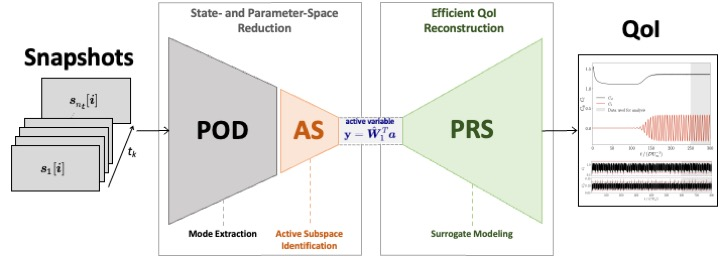

# POD-AS-PRS

> **A modular Python framework for sensitivity-driven dimensionality reduction and high-fidelity reconstruction of quantities of interest (QoI). This tool identifies sensitivity-dominant POD modes through Active Subspace analysis to build low-dimensional, physically interpretable manifolds**
>
> POD → ResNet → Active Subspaces → Polynomial Response Surface




---

## Overview

This repository provides a clean, modular implementation of the
**POD-AS-PRS** pipeline for building efficient, interpretable
surrogates of the CFD QoI functionals directly from
high-fidelity flow-field snapshots.

| Step | Module | Method | Role |
|:----:|--------|--------|------|
| 1 | `core/pod_engine.py` | **Proper Orthogonal Decomposition** | Compress flow snapshots into a low-dimensional POD coefficient vector via truncated SVD |
| 2 | `core/resnet_model.py` · `resnet_trainer.py` | **Residual Network (ResNet)** | Learn the nonlinear map POD coefficients → scalar QoI |
| 3 | `core/gradient_analysis.py` | **AD / FD gradients** | Compute ∂QoI/∂POD_coeff. via automatic differentiation; validate against finite-difference |
| 4 | `lib/active_subspaces/` | **Active Subspaces (AS)** | Identify the dominant low-dimensional input subspace via gradient covariance eigendecomposition |
| 5 | `lib/.../utils/rs.py` | **Polynomial Response Surface (PRS)** | Fit a polynomial surrogate in the compressed active-variable space |

---


> **Note — Examples and Data**
> The case studies and the corresponding simulation datasets
> are not included in this public release.
> If you would like access to the full case-study notebooks or the CFD datasets
> (2-D cylinder wake and NACA 4412 airfoil), please contact the authors directly.

---

## Installation

```bash
# 1. Clone
git clone https://github.com/Dewu-Yang/POD-AS-PRS.git
cd POD-AS-PRS

# 2. Create a virtual environment (recommended)
python -m venv .venv
source .venv/bin/activate          # Windows: .venv\Scripts\activate

# 3. Install dependencies
pip install -r requirements.txt
```

**Core dependencies** — `numpy`, `scipy`, `matplotlib`, `torch>=2.0`,
`scikit-learn`, `pandas`, `seaborn`, `tqdm`, `jupyter`, `pymech`.


---

## Usage

### 1 · Preprocess raw Nek5000 snapshots *(one-off)*

```python
from utils.preprocessing import merge_flow_fields

merge_flow_fields(
    data_dir='data/your_case/raw/',
    output_path='data/your_case/flow_field_data.npz',
    geometry='cylinder',      # or 'naca4412'
)
```

### 2 · Load data and run POD

```python
from utils.data_loader import load_and_preprocess_data

train_loader, val_loader, test_loader, pod_coeffs, pod_coeffs_norm, \
    pod_mean, pod_std, qoi_mean, qoi_std, *_ = load_and_preprocess_data(
        flow_data_path='data/your_case/flow_field_data.npz',
        qoi_data_path='data/your_case/qoi.dat',
        num_pod_coeffs=150,     # number of POD modes to retain
        train_ratio=0.8,
        val_ratio=0.1,
        batch_size=32,
    )
```

### 3 · Train the ResNet surrogate

```python
import torch
from core.resnet_model   import ResNet
from core.resnet_trainer import set_random_seed, load_or_train

set_random_seed(42)
device = torch.device('cuda' if torch.cuda.is_available() else 'cpu')
model  = ResNet(input_size=150, hidden_size=128,
                num_blocks=7, dropout_rate=0.1).to(device)

model, train_losses, val_losses = load_or_train(
    model, train_loader, val_loader, device,
    model_save_path='results/resnet_model.pth',
    num_epochs=1000,
    patience=100,
    lr=0.001,
    weight_decay=1e-4,
)
```

### 4 · Compute gradients and identify Active Subspaces

```python
import numpy as np
from core.resnet_trainer import compute_all_gradients
import lib.active_subspaces as ac

gradients = compute_all_gradients(model, pod_coeffs, device, batch_size=32)

scale = (pod_coeffs.max(0) - pod_coeffs.min(0)) / 2.0
scale[scale < 1e-10] = 1.0
gradients_scaled = gradients * scale

ss = ac.subspaces.Subspaces()
ss.compute(df=gradients_scaled, nboot=1000)
ss.partition(n_active)          # choose active subspace dimension

opts = ac.utils.plotters.plot_opts(savefigs=True)
ac.utils.plotters.eigenvalues(ss.eigenvals[:20], e_br=ss.e_br[:20], opts=opts)
```

### 5 · Fit a Polynomial Response Surface

```python
from lib.active_subspaces.utils.rs import PolynomialApproximation

pod_min, pod_max = pod_coeffs.min(0), pod_coeffs.max(0)
pod_norm = 2.0 * (pod_coeffs - pod_min) / (pod_max - pod_min) - 1.0
y_active = pod_norm @ ss.W1        # project onto active subspace

qoi_raw = np.loadtxt('data/your_case/qoi.dat')[:, 1]
X_tr, X_te, f_tr, f_te = train_test_split(
    y_active, qoi_raw, test_size=0.2, random_state=42
)

RS = PolynomialApproximation(N=3)
RS.train(X_tr, f_tr.reshape(-1, 1))
print(f'Train R² = {RS.Rsqr:.6f}')
```

---


## Acknowledgements

The `lib/active_subspaces/` directory is adapted from the
**Python Active Subspaces Utility Library** by Paul G. Constantine and
David Gleich, released under the MIT License.

> Constantine, P. G. (2015). *Active Subspaces: Emerging Ideas for Dimension
> Reduction in Parameter Studies*. SIAM Spotlights.
> doi: [10.1137/1.9781611973860](https://doi.org/10.1137/1.9781611973860)

Original repository: <https://github.com/paulcon/active_subspaces>

---

## Citation

If you use this code in your research, please cite:

```bibtex
@article{XXXX2026,
  title   = {Identifying sensitivity-dominant parameters via active subspaces in reduced-order modeling of fluid dynamics},
  author  = {Yang, D., Wang R., Lai, P., Wang, J., Wang, F., Xu, H.},
  journal = {Nonlinear Dynamics},
  year    = {2026},
  doi     = {xx.xxxx/xxxxxx}
}
```

---

## License

This project is released under the [MIT License](LICENSE).
